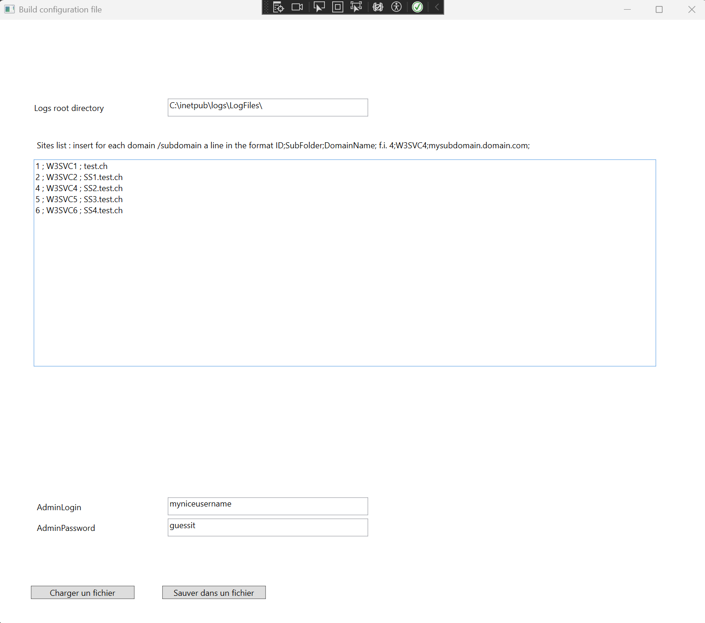
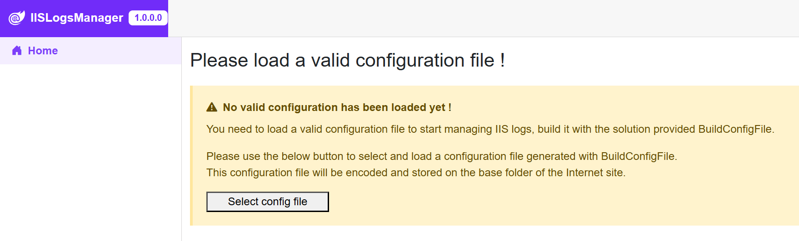
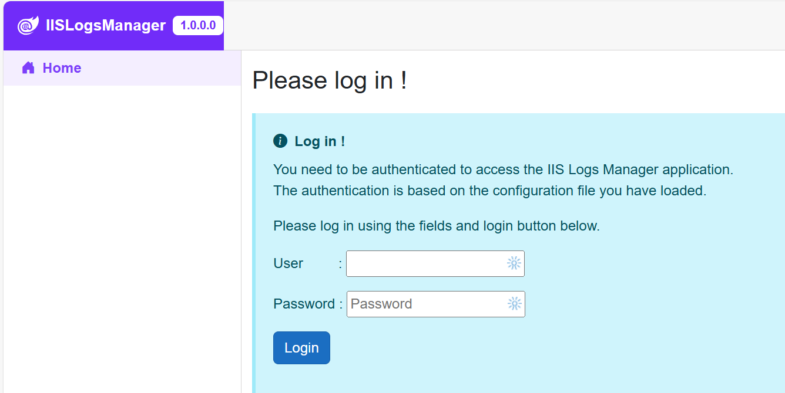
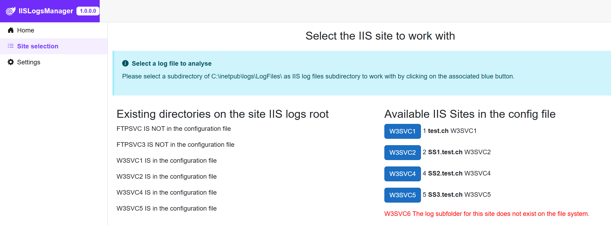
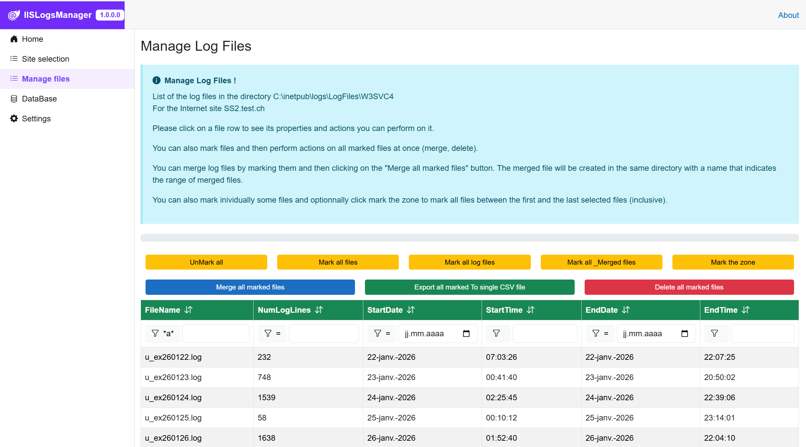
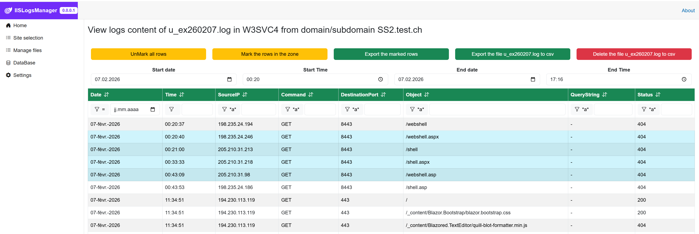
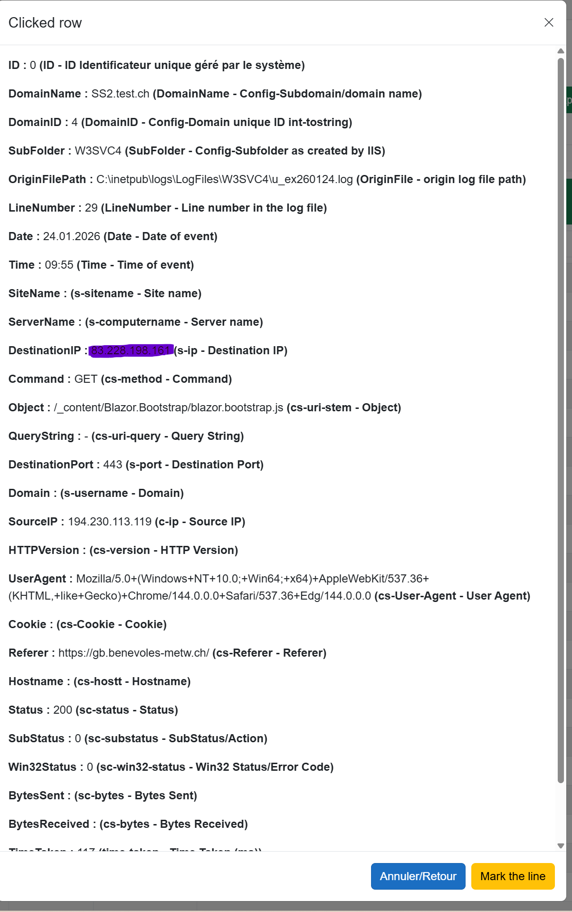

[TOC]

# 1. Introduction

The IIS Logs Manager is a Micrososft Blazor Web (Server side) application to be deployed on a .Net 10 ASP server with IIS Server version 10.0.

It has not been tested with other versions.

It is developed with Visual Studio 2026 but is very likely compatible with Visual Studio 2022.

The app uses Vikram Gaddam BlazorBootstrap (NuGet)

https://github.com/vikramlearning/blazorbootstrap

# 2. Main functionalities

The application allows you to:

- List the files available in the IIS Server Logs directories (usually C:\\inetpub\logs\LogFiles\W3SVC1 ... \)
- Delete a single file or a set of files
- Merge multiple files into a single file
- Export a single or multiple files to .csv file for import in calculation sheet or database.
- view the content of logs files
- sort content on major fields like client IP, Command, Object, Port used, returned code ... 
- export portion of the file to csv format
- reporting fields are identified from the #Fields: line(s) available in each log file to cope with different reporting options
- ....

# 3. Configuration

The solution contains a Windows Desktop WPF APP, the BuildConfigFile that will create a text file with configuration information.

For the time being:

- Root of the files on the server  (f.i. C:\\inetpub\logs\LogFiles)
- The Subfolders allowed for exporation (f.i. W3SVC1, W3SVC2,....) and associated domain/subdomain names (used for documentation only)
- user login username and password (unique)

The generated text file can be imported by the online app and will be stored in a cryted format on the app root of the app site.

Note that some room is left for future purpose ;-)

# 4. Example pages

## 4.1 Page for App loaded, no configuration file avaiable

## 4.2 Login (with fixed configuration credentials)

## 4.3 Select subfolder to explore/manage

Note 1: you have no access to subfolders NOT IN THE CONFIGURATION FILE (here the FTP folders but you can include them in the configuration if whished).

Note 2: The W3SVC6 folder is missing on the site

## 4.4 Work with logs files

Click on a line to get full info and submenu

## 4.5 Manage/view log file (draft)

Again, click on a line to get full details

